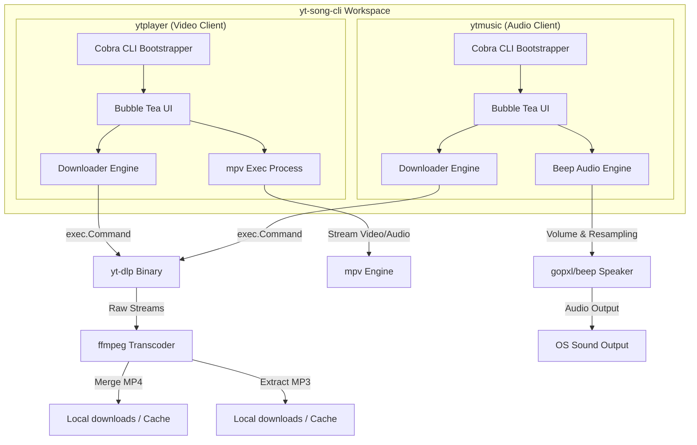

# ⚡ YouTube Terminal Suite (yt-song-cli)

[](https://golang.org/)
[](LICENSE)
[](https://github.com/Ping-Phantom39/yt-cli)
[](https://github.com/charmbracelet/bubbletea)

## 🖥️ Supported Operating Systems

The tools are written in Go and rely on native audio/video back‑ends. They have been tested and are officially supported on:

- **Linux** (Ubuntu, Debian, Fedora, etc.) – requires ALSA/PulseAudio/pipewire libraries.
- **macOS** – uses CoreAudio via the `beep` library.
- **Windows** – builds with CGO and uses WASAPI; however the current CI and packaging focus on Linux/macOS.

For other platforms you may need to install the required audio/video dependencies manually.

Welcome to the **YouTube Terminal Suite** (`yt-song-cli`), a professional monorepo housing two high-performance, keyboard-driven Go CLI applications styled with a sleek cyberpunk aesthetic. The suite features a video streaming player (`ytplayer`) and an offline audio player/downloader (`ytmusic`), providing the ultimate terminal-native YouTube media experience.

---

## 🧭 Monorepo Overview

This repository contains two decoupled, highly modular Go utilities:

| Component | Target Directory | Binary Name | Description | Key Technologies |
|---|---|---|---|---|
| **Video Client** | [`/yt-player`](yt-player) | `ytplayer` | Cyberpunk terminal video searcher, downloader, and mpv-backed streaming player. | `yt-dlp`, Bubble Tea, `mpv` |
| **Audio Client** | [`/yt-song`](yt-song) | `ytmusic` | Highly optimized music player with low-level audio streaming and local MP3 caching. | `yt-dlp`, Bubble Tea, `gopxl/beep` |

---

## 🎨 System Architecture

The following diagram illustrates how the CLI tools leverage standard Go layouts and external binaries for media scraping, multiplexing, transcoding, and low-level playback:




### ⚙️ Deep-Dive Engine Architecture (Under the Hood)

#### 1. 🚀 Cobra CLI Bootstrapper (`cmd/`)
* **Flag & Argument Parsing**: Built on top of `spf13/cobra`, the bootstrapper parses runtime configuration parameters (`--limit`, `--cookies`, `--cookies-from-browser`, `--vo`, `--check`) and environment overrides.
* **Environment & Dependency Check**: Executes pre-flight scans verifying that external binaries (`yt-dlp`, `ffmpeg`, `mpv`) and CGO audio headers exist on the host system before spawning the interface.
* **TUI Lifecyle Management**: Initializes application state structs and bootstraps the main event loop.

#### 2. 🖥️ Bubble Tea Reactive TUI Engine (`internal/ui/`)
* **Model-View-Update (MVU) Loop**: Powered by `charmbracelet/bubbletea` (Elm architecture pattern). User keystrokes are received as `tea.Msg` events, processed in pure `Update()` functions, and rendered deterministically in `View()`.
* **Asynchronous Command Orchestration**: Non-blocking network queries and media downloads run in isolated goroutines, dispatching `tea.Cmd` response messages back into the main event loop without freezing user interface animations.
* **Styling & Layout Rendering**: Uses `charmbracelet/lipgloss` for cyberpunk neon borders, HSL gradient text, and dynamic viewport calculation, alongside `charmbracelet/bubbles` for text input inputs and progress bar components.

#### 3. 📥 Asynchronous Downloader Engine (`internal/downloader/`)
* **Metadata Extraction**: Spawns sub-processes of `yt-dlp` using Go's `os/exec.Command` with flags (`--dump-json`, `--flat-playlist`). Reads standard output streams in real-time to parse JSON video metadata (ID, title, channel, duration, view count) into strongly-typed Go structs.
* **Transcoding & Multiplexing Pipe**:
  * **Video (`ytplayer`)**: Invokes `yt-dlp` to download best-quality separate video and audio streams, piping them to `ffmpeg` for container multiplexing into high-definition `.mp4` files inside `downloads/`.
  * **Audio (`ytmusic`)**: Triggers `yt-dlp` audio extraction and uses `ffmpeg` to transcode streams into `.mp3` files formatted specifically for low-latency PCM decoding.
* **Real-time Progress Parsing**: Intercepts `stdout` lines matching percentage regex patterns (`[download] XX.X%`), emitting real-time progress update messages to the TUI progress bar component.

#### 4. 🎬 `mpv` Video Process Controller (`yt-player/internal/player/`)
* **Terminal Handover Protocol**: Uses Bubble Tea's `tea.ExecProcess` wrapper. When a user streams a video, the TUI loop is cleanly suspended, handing standard input/output over to the native `mpv` binary.
* **Hardware & Terminal Video Drivers**: Leverages `mpv`'s video output (`--vo`) capabilities, allowing seamless switching between external GUI windows (`gpu`, `x11`) and terminal graphics rendering (`tct`, `sixel`, `kitty`).
* **Auto-Resume**: Upon `mpv` exit or termination signal, the terminal buffer is restored, and the Bubble Tea TUI seamlessly resumes playback state.

#### 5. 🔊 Beep Audio Engine & CGO Speaker (`yt-song/internal/player/`)
* **PCM Buffer Decoding**: Built using `gopxl/beep`. Reads local `.mp3` audio files and streams them into floating-point PCM audio buffers.
* **Logarithmic Volume Control**: Rather than simple linear volume scaling, volume adjustments use a logarithmic scale (`math.Pow`) to match natural human auditory perception curves.
* **Low-Level OS Sound Integration**: Uses CGO bindings to interface directly with OS native sound system APIs:
  * **Linux**: ALSA (`libasound2`) / PulseAudio / PipeWire.
  * **macOS**: CoreAudio.
  * **Windows**: WASAPI.

---

## 🚀 System Requirements & Setup

Before compiling, make sure your operating system has the necessary external libraries and executable tools installed.

### 1. External Media CLI Utilities
Both applications require **`yt-dlp`** and **`ffmpeg`**. In addition, `ytplayer` requires **`mpv`**.

#### **Debian/Ubuntu**
```bash
sudo apt-get update
sudo apt-get install -y mpv ffmpeg nodejs
```

#### **macOS (via Homebrew)**
```bash
brew install mpv ffmpeg nodejs
```

> [!TIP]
> Node.js or Deno are optional but highly recommended to help `yt-dlp` bypass YouTube's signature bot blocks.

#### **Installing/Updating `yt-dlp` (Recommended)**
Ensure you have the latest `yt-dlp` build to handle changing YouTube API formats. The tools will check `./bin/yt-dlp` first, falling back to your system `$PATH`.
```bash
sudo curl -L https://github.com/yt-dlp/yt-dlp/releases/latest/download/yt-dlp -o /usr/local/bin/yt-dlp
sudo chmod a+rx /usr/local/bin/yt-dlp
```

### 2. Audio Library Headers (Linux Only - Required for compilation)
`ytmusic` compiles low-level Go bindings to talk directly to your system's ALSA speakers:

* **Debian/Ubuntu**:
  ```bash
  sudo apt-get install -y libasound2-dev
  ```
* **Fedora/CentOS/RHEL**:
  ```bash
  sudo dnf install alsa-lib-devel
  ```
* **macOS**: No additional headers needed (native CoreAudio support).

---

## 🛠️ Compilation & Installation

### 📦 Download via Ubuntu PPA

```bash
sudo add-apt-repository ppa:kamalchad/ytmusic
sudo apt update
sudo apt install ytmusic
```

> [!WARNING]
> **Disclaimer**: Installing via PPA automatically includes all necessary packages (`yt-dlp`, `mpv`, `ffmpeg`, `libasound2-dev`) along with the binary, which may be **600 – 700 MB** in total download size.

#### ⚠️ Possible Errors & Troubleshooting

* **Outdated `yt-dlp` Version (`403 Forbidden` / Bot Block Errors)**:
  System or PPA repositories may package an older version of `yt-dlp` that causes playback/search failures with YouTube API changes. Upgrade `yt-dlp` to the latest release using pip:
  ```bash
  python3 -m pip install -U yt-dlp
  ```
  or update directly via official GitHub binary:
  ```bash
  sudo curl -L https://github.com/yt-dlp/yt-dlp/releases/latest/download/yt-dlp -o /usr/local/bin/yt-dlp
  sudo chmod a+rx /usr/local/bin/yt-dlp
  ```

* **Missing Audio Backend Libraries**:
  If audio output or CGO bindings fail to launch, ensure sound packages are installed:
  ```bash
  sudo apt-get install -y libasound2-dev alsa-utils
  ```

---

### 🎵 `ytmusic` (Audio Client via Script)
```bash
curl -fsSL https://raw.githubusercontent.com/Ping-Phantom39/yt-cli/main/yt-song/scripts/install.sh | bash
```

---

### 🎬 `ytplayer` (Video Client via Script)
```bash
curl -fsSL https://raw.githubusercontent.com/Ping-Phantom39/yt-cli/main/yt-player/scripts/install.sh | bash
```

### Manual Compilation from Source
Ensure you have **Go 1.22+** installed on your system. Navigate to the desired module directory to build:

#### Build `ytplayer`
```bash
cd yt-player
go build -o ../bin/ytplayer main.go
```

#### Build `ytmusic`
```bash
cd yt-song
go build -o ../bin/ytmusic main.go
```

---

## 🕹️ Interactive Controls & Usage

### Run ytmusic from anywhere(global access)


### 1. `ytplayer` (Video Client)

Start the player and launch the interactive terminal interface:
```bash
./bin/ytplayer
```
Or search directly from startup:
```bash
./bin/ytplayer "cyberpunk synthwave lofi"
```

#### **Options and Flags**
* `-l, --limit int`: Maximum search results to query (default: `15`).
* `--cookies string`: Custom file path containing exported session cookies.
* `--cookies-from-browser string`: Extract session cookies directly from a specific browser (e.g. `chrome`, `firefox`, `safari`, `brave`, `edge`).
* `--vo string`: Override the `mpv` video output driver (e.g., `tct`, `sixel`, `kitty`, `gpu`). Useful for streaming inside headless/SSH sessions.
* `--check`: Quick check of local media tools and dependency status.

#### **TUI Keyboard Shortcuts**
* `[/]` &mdash; Focus the search bar to enter queries.
* `[Enter]` &mdash; Stream the highlighted video using `mpv` (or play from local cache if downloaded).
* `[d]` &mdash; Background download the video as high-quality `.mp4` into `downloads/`.
* `[Esc]` &mdash; Unfocus search bar and return to result browsing.
* `[q]` or `[Ctrl+C]` &mdash; Quit the application.

---

### 2. `ytmusic` (Audio Client)

Start the music player:
```bash
./bin/ytmusic
```
Or start with a search query:
```bash
./bin/ytmusic "lofi beats for studying"
```

#### **Options and Flags**
* `-l, --limit int`: Maximum search results to query (default: `15`).
* `--cookies string`: Custom Netscape format cookies file path.
* `--cookies-from-browser string`: Load cookies from a browser profile to avoid bot bans.
* `--check`: Verify local configuration and audio device capability.

#### **TUI Keyboard Shortcuts**
* `[/]` &mdash; Focus the search bar.
* `[Enter]` (on result) &mdash; Download and start streaming audio via system speaker.
* `[Space]` &mdash; Pause/Resume playback.
* `[s]` &mdash; Stop playback.
* `[Left]` / `[Right]` or `[h]` / `[l]` &mdash; Seek backward/forward by 5 seconds.
* `[` / `]` &mdash; Adjust volume down/up by 5% (Logarithmic scale).
* `[Esc]` &mdash; Unfocus search input.
* `[q]` or `[Ctrl+C]` &mdash; Stop playback, cancel active downloads, and exit.

---

## 🍪 Bypassing Anti-Bot Blocking

When running these tools on servers (VPS, Cloud environments) or restricted subnets, YouTube may throw HTTP `403 Forbidden` or CAPTCHA errors. Use the following integration options to supply personal session cookies:

1. **Browser Extraction (Local Client Only)**:
   Instruct the downloader to pull cookies directly from your active browser profile:
   ```bash
   ./bin/ytmusic --cookies-from-browser chrome "vaporwave"
   ```
2. **Netscape Cookies File (Server/Remote)**:
   Export cookies using a browser extension (such as *Get cookies.txt LOCALLY*) to a text file (e.g., `cookies.txt`). Place it in the app directory or pass it as a flag:
   ```bash
   ./bin/ytplayer --cookies ./cookies.txt "synthwave"
   ```

---

## 📁 Codebase Layout

```text
yt-song-cli/
├── yt-player/                 # Video TUI Application (ytplayer module)
│   ├── cmd/                   # Cobra commands & flags definitions
│   ├── internal/              # Core business logic
│   ├── go.mod                 # Module requirements
│   └── README.md              # Video project documentation
│
└── yt-song/                   # Audio TUI Application (ytmusic module)
    ├── cmd/                   # Cobra CLI commands & flags
    ├── internal/              # Core business logic
    ├── go.mod                 # Module requirements
    └── README.md              # Audio project documentation
```

### 🔗 Quick Navigation

* **Video Player (`yt-player`):**
  * Entry point: [yt-player/main.go](yt-player/main.go)
  * Readme: [yt-player/README.md](yt-player/README.md)
* **Audio Player (`yt-song`):**
  * Entry point: [yt-song/main.go](yt-song/main.go)
  * Readme: [yt-song/README.md](yt-song/README.md)

---

# Run `ytmusic` Globally Using a Wrapper Script(Possible Encounter Issue)

If `ytmusic` requires a local `--cookies.txt` file, creating a symbolic link with `ln -s` is **not enough**. A symbolic link only points to the executable—it **does not change the current working directory**.

As a result, when you run:

```bash
ytmusic
```

from another directory, the application searches for `--cookies.txt` in your **current working directory** instead of the directory containing the binary.

## Solution

Create a **wrapper script** in `/usr/local/bin` that changes to the directory containing the binary before executing it.

### Step 1: Create the wrapper script

```bash
sudo nano /usr/local/bin/ytmusic
```

### Step 2: Add the following contents

```bash
#!/bin/bash

cd /home/codespace/ || exit 1
exec ./ytmusic "$@"
```

> **Note:** Replace `/home/codespace/` with the directory where your `ytmusic` binary and `.env` file are located.

### Step 3: Make the wrapper executable

```bash
sudo chmod +x /usr/local/bin/ytmusic
```

### Step 4: Run the application

Now you can run the application from **any directory**:

```bash
ytmusic
```

## How It Works

The wrapper script performs the following steps:

1. Changes the current working directory to the directory containing the binary.
2. Executes the `ytmusic` binary.
3. Forwards any command-line arguments to the application using `"$@"`.

Because the working directory is correct, the application can successfully locate the local `.env` file.

## Why Not Use a Symbolic Link?

For example:

```bash
sudo ln -s /home/codespace/ytmusic /usr/local/bin/ytmusic
```

Although this allows the command to be found in your `PATH`, it **does not** change the working directory.

If the Go application loads `.env` like this:

```go
godotenv.Load()
```

or

```go
os.Open(".env")
```

it searches for:

```
<current-working-directory>/.env
```

instead of:

```
/home/codespace/.env
```

Therefore, a wrapper script is the simplest solution when you do not want to modify the Go source code.

## Similar work for the ytplayer binary  file too

## Summary

- ✅ Works globally from any directory.
- ✅ No changes to the Go application are required.
- ✅ Ensures `.env` is always loaded from the correct location.
- ✅ Passes all command-line arguments to the application.

## 📄 License

This project is licensed under the MIT License. See individual directories for any localized licenses or dependency notes.
