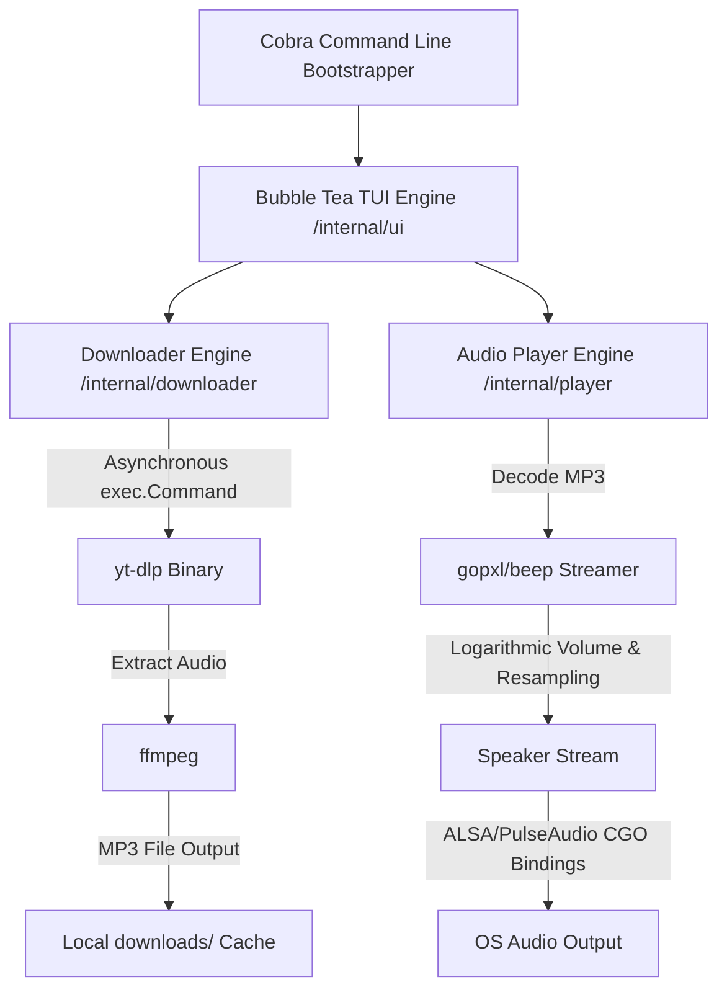

# ⚡ YTMusic Terminal Player

A highly professional, modular, and keyboard-driven Go CLI application that allows users to search for YouTube videos/music, download them as high-quality MP3s, and stream them directly inside their terminal.

Built with a cyberpunk neon aesthetic, utilizing **Bubble Tea** for the UI, **yt-dlp** for async scraping and downloading, and **gopxl/beep** for low-level audio streaming.

---

## 🎨 Architectural Design



The application is structured according to clean Go project layout standards:
* **`/cmd`**: Contains Cobra command parsing, flags, examples, and application bootstrapping.
* **`/internal/ui`**: Holds the Bubble Tea model, viewport renderer, key bindings, and async message-passing routines.
* **`/internal/downloader`**: Interfaces with the `yt-dlp` executable, parsing streaming progress percentage and search queries from JSON.
* **`/internal/player`**: Wraps the `gopxl/beep` low-level library, handling logarithmic volume scaling, seeking, and playing.

---

## 🚀 System Prerequisites & Downstream Setup

To compile and execute this application successfully, you must ensure that all external media binaries and development audio headers are installed on your host system.

### 1. ALSA Development Libraries (Linux Only)
The native audio playing engine compiled via CGO needs ALSA headers to connect to system speakers:
* **Debian/Ubuntu**:
  ```bash
  sudo apt-get update
  sudo apt-get install -y libasound2-dev
  ```
* **Fedora/RHEL**:
  ```bash
  sudo dnf install alsa-lib-devel
  ```
* **macOS**:
  No extra libraries are needed as CoreAudio is natively supported by `beep`.

### 2. Media Downloader (`yt-dlp`)
The search and download backend relies on `yt-dlp`. 
* The application will automatically check for a local binary located at `./bin/yt-dlp`.
* If not present, it will search the global system `$PATH`.

To install it globally:
```bash
# Via official GitHub Releases (Recommended for latest hotfixes)
sudo curl -L https://github.com/yt-dlp/yt-dlp/releases/latest/download/yt-dlp -o /usr/local/bin/yt-dlp
sudo chmod a+rx /usr/local/bin/yt-dlp
```

Verify the installation path and version:
```bash
which yt-dlp
yt-dlp --version
```

### 3. Media Transcoder (`ffmpeg`)
`yt-dlp` requires `ffmpeg` to extract and transcode the downloaded YouTube audio stream into an MP3 file:
* **Debian/Ubuntu**:
  ```bash
  sudo apt-get install -y ffmpeg
  ```
* **macOS** (via Homebrew):
  ```bash
  brew install ffmpeg
  ```

Verify `ffmpeg` mapping:
```bash
which ffmpeg
ffmpeg -version
```

---

## 🛠️ Installation & Compilation

### 📦 Download via Ubuntu PPA

```bash
sudo add-apt-repository ppa:kamalchad/ytmusic
sudo apt update
sudo apt install ytmusic
```

> [!WARNING]
> **Disclaimer**: Installing via PPA automatically includes all necessary packages (`yt-dlp`, `mpv`, `ffmpeg`, `libasound2-dev`) along with the binary, which may be **600 – 700 MB** in total download size.

#### ⚠️ Possible Errors & Troubleshooting

* **Outdated `yt-dlp` Version (`403 Forbidden` / Bot Block Errors)**:
  System or PPA repositories may package an older version of `yt-dlp` that causes playback/search failures with YouTube API changes. Upgrade `yt-dlp` to the latest release using pip:
  ```bash
  python3 -m pip install -U yt-dlp
  ```
  or update directly via official GitHub binary:
  ```bash
  sudo curl -L https://github.com/yt-dlp/yt-dlp/releases/latest/download/yt-dlp -o /usr/local/bin/yt-dlp
  sudo chmod a+rx /usr/local/bin/yt-dlp
  ```

* **Missing Audio Backend Libraries**:
  If audio output or CGO bindings fail to launch, ensure sound packages are installed:
  ```bash
  sudo apt-get install -y libasound2-dev alsa-utils
  ```

---

### ⚡ Quick One-Line Installation (via curl)

```bash
curl -fsSL https://raw.githubusercontent.com/Ping-Phantom39/yt-cli/main/yt-song/scripts/install.sh | bash
```

### Manual Compilation

Ensure you are using **Go 1.22+**:

1. **Download Go dependencies**:
   ```bash
   go mod download
   ```
2. **Compile the binary**:
   ```bash
   go build -o ytmusic main.go
   ```
3. **Install globally** (optional):
   ```bash
   go install
   ```

---

## 🕹️ Keyboard Controls & Navigation

When the application is running, navigate the UI with these interactive keyboard shortcuts:

| Key | Action |
|---|---|
| `/` | Focus search bar (allows typing queries) |
| `Enter` (in search) | Submit and perform asynchronous search query |
| `Esc` (in search) | Defocus search input and return to list navigation |
| `Up` / `Down` or `k` / `j` | Navigate selection list |
| `Enter` (in list) | Download and start playing the highlighted track |
| `Space` | Toggle Play / Pause |
| `s` | Stop audio playback |
| `Left` / `Right` or `h` / `l` | Seek backward or forward by **5 seconds** |
| `[` / `]` | Lower or raise volume by **5%** (Logarithmic scale) |
| `q` or `Ctrl+C` | Halt audio, cancel ongoing downloads, and exit player |

---

## 🍪 Bypassing Bot Controls (Cookies)

If your environment's IP address (e.g., a VPS or cloud server) is being throttled or flagged by YouTube, you can load your personal session cookies to authenticate:

1. **Export browser cookies**: Use a browser extension (like "Get cookies.txt LOCALLY") to export your cookies in Netscape format.
2. **Pass cookies file**:
   ```bash
   ./ytmusic --cookies ./cookies.txt "my favorite song"
   ```
3. **Direct browser extraction**: If running on your local machine, you can instruct `yt-dlp` to extract cookies directly from your default browser profile:
   ```bash
   ./ytmusic --cookies-from-browser chrome "lofi beats"
   ```
   Supported browser flags: `chrome`, `firefox`, `brave`, `safari`, `edge`.

## 📁 Streaming Temporary File Location

When you play a track (press **Enter** on a search result), the binary creates a temporary directory under the system temporary area (e.g., `/tmp/ytmusic-XXXXXX`). The MP3 stream is written to a file named `<video-id>.mp3` inside that directory. The path is kept in the UI model as `m.currentTempFile`. As soon as playback finishes or you stop it, the temporary file **and its parent directory** are automatically removed.

**Key points**

- **Location**: a temporary directory under `/tmp` (e.g., `/tmp/ytmusic-abc123/...`).
- **Lifetime**: only while the track is playing; the file is deleted automatically after playback.
- **Permanent download**: press **`d`** to save the audio to `./downloads/<video-id>.mp3`.

This ensures streaming does not leave residual files on disk.
